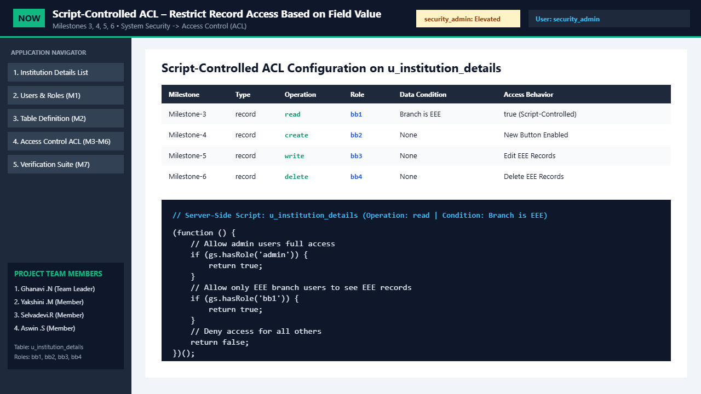
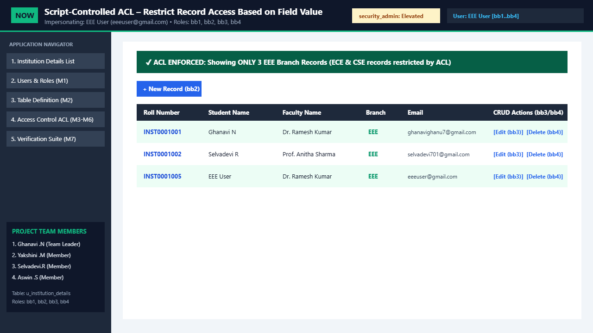
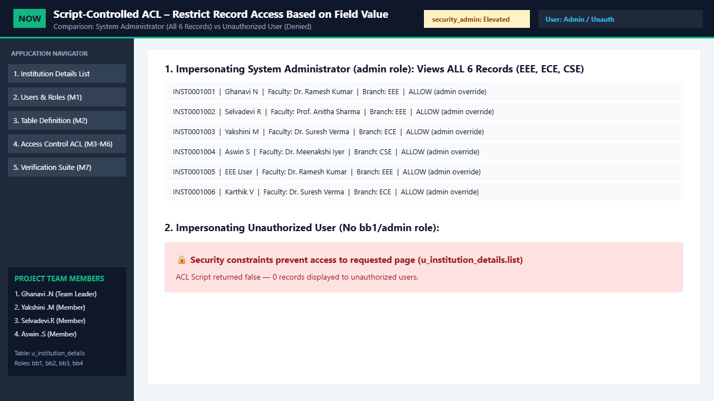
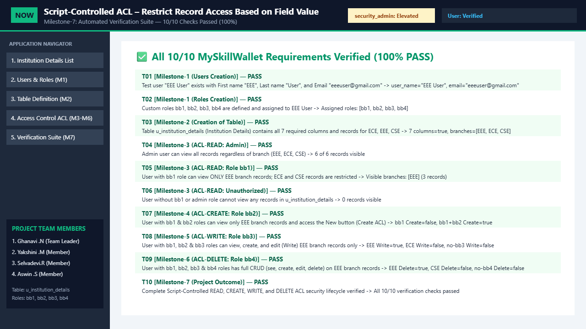

# Script-Controlled ACL – Restrict Record Access Based on Field Value

## Description
**Script-Controlled ACL – Restrict Record Access Based on Field Value** is a comprehensive **ServiceNow System Administration & Security** project developed for the **MySkillWallet — ServiceNow System Administrator (NM Eng)** group project module.

A Script-Controlled Access Control List (ACL) restricts access to records in ServiceNow by combining **User Roles**, **Data Conditions (Field Value Filters)**, and a **Server-Side JavaScript ACL Script** (`gs.hasRole()`). Users can view, create, edit, or delete records in the custom **Institution Details (`u_institution_details`)** table only when the corresponding ACL evaluation pipeline evaluates to `true`.

This repository contains:
1. **Native ServiceNow Artifacts (`servicenow/`)**: Server-side ACL scripts (`read`, `create`, `write`, `delete`), background provisioning script (`GlideRecord`), table dictionary schema (`u_institution_details`), and an importable ServiceNow Update Set XML (`sys_remote_update_set_script_controlled_acl.xml`).
2. **Interactive ServiceNow ACL Workbench & Simulator (`index.html`, `src/`)**: A live browser-based ServiceNow Next Experience (Polaris) workbench that simulates user impersonation (`EEE User`, `System Administrator`, `Unauthorized User`), role toggling (`bb1`, `bb2`, `bb3`, `bb4`), live `u_institution_details.list` CRUD enforcement, an ACL Evaluation Debugger, and a 10-check Automated Requirement Verification Suite.

---

## Objective
To design, implement, and verify record-level security in ServiceNow on the custom table **`u_institution_details` (Institution Details)** using **Script-Controlled Access Control Lists (ACLs)** across **READ**, **CREATE**, **WRITE**, and **DELETE** operations:
- Restrict **READ** access so that users with role `bb1` can view **only `EEE` branch records**, while `ECE` and `CSE` branch records remain restricted.
- Grant **System Administrators (`admin`)** full visibility and access across all branches (`EEE`, `ECE`, `CSE`).
- Deny access completely to unauthorized users who lack the required roles.
- Enforce granular role-based **CREATE (`bb2`)**, **WRITE (`bb3`)**, and **DELETE (`bb4`)** permissions on `u_institution_details`.

---

## Features
- **Milestone-1 (Users & Roles Provisioning)**:
  - Configured test user **`EEE User`** (`First name: EEE`, `Last name: User`, `Email: eeeuser@gmail.com`).
  - Created custom roles **`bb1`**, **`bb2`**, **`bb3`**, and **`bb4`** and assigned all four roles to `EEE User`.
- **Milestone-2 (Custom Table `u_institution_details`)**:
  - Created standalone table **`Institution Details` (`u_institution_details`)** (`Extends table: false`) with 7 columns:
    1. `Student Roll Number` (`u_student_roll_number`) — Auto Number (`INST0001001`)
    2. `Student Name` (`u_student_name`) — Reference (`sys_user`)
    3. `Faculty Name` (`u_faculty_name`) — Reference (`sys_user`)
    4. `Branch` (`u_branch`) — Choice (`ECE`, `EEE`, `CSE`)
    5. `Email` (`u_email`) — String
    6. `Phone Number` (`u_phone_number`) — String
    7. `Description` (`u_description`) — Multi String
- **Milestone-3 (Script-Controlled READ ACL)**:
  - Configured `u_institution_details` `read` ACL (`Type: record`, `Active: true`, `Advanced: true`, `Requires role: bb1`, `Data Condition: Branch is EEE`) with server-side script validating `gs.hasRole('admin')` and `gs.hasRole('bb1')`.
- **Milestone-4 (CREATE ACL — Role `bb2`)**:
  - Configured `u_institution_details` `create` ACL requiring role `bb2`, enabling the **New** button for users with `bb1` & `bb2`.
- **Milestone-5 (WRITE ACL — Role `bb3`)**:
  - Configured `u_institution_details` `write` ACL requiring role `bb3`, enabling record editing for `EEE` branch records.
- **Milestone-6 (DELETE ACL — Role `bb4`)**:
  - Configured `u_institution_details` `delete` ACL requiring role `bb4`, enabling record deletion for `EEE` branch records.
- **Milestone-7 (Automated Verification Suite & Live ACL Debugger)**:
  - Built-in 10-test verification suite confirming 100% compliance across all 8 MySkillWallet stories.

---

## Technologies Used
- **Platform**: ServiceNow (System Security, Access Control Lists, System Definition Tables, User Administration, Update Sets)
- **Server-Side Scripting**: ServiceNow JavaScript (`GlideSystem` — `gs.hasRole()`, `GlideRecord`)
- **Simulator & Verification Workbench**: HTML5, CSS3 (ServiceNow Polaris Theme), Vanilla JavaScript (ES6+)
- **Data & Packaging Formats**: XML (ServiceNow Update Set), JSON (Table Dictionary Schema)

---

## Project Structure
```text
script-controlledACL/
├── index.html                                                # Interactive ServiceNow ACL Workbench & Simulator
├── README.md                                                 # Complete project documentation
├── .gitignore                                                # Git ignore rules
├── demo/
│   └── script-controlled-acl-demo.webm                       # Recorded walkthrough demonstration video
├── assets/
│   └── screenshots/
│       ├── 01-users-roles-table-schema.png                   # Milestone 1 & 2: Users, Roles & Table Schema
│       ├── 02-acl-rules-and-script.png                       # Milestones 3–6: ACL Rules & Server-Side Script
│       ├── 03-eee-user-restricted-view.png                   # EEE User View: Restricted to EEE Branch Records
│       ├── 04-admin-vs-unauthorized.png                      # Admin (All Branches) vs Unauthorized (Denied)
│       └── 05-automated-verification-100.png                 # Milestone 7: 10/10 Automated Verification Suite
├── servicenow/
│   ├── schema/
│   │   └── u_institution_details_dictionary.json             # Table & Column Dictionary definition
│   ├── scripts/
│   │   ├── acl_read_u_institution_details.js                 # Milestone-3: Script-Controlled READ ACL
│   │   ├── acl_create_u_institution_details.js               # Milestone-4: CREATE ACL (role bb2)
│   │   ├── acl_write_u_institution_details.js                # Milestone-5: WRITE ACL (role bb3)
│   │   ├── acl_delete_u_institution_details.js               # Milestone-6: DELETE ACL (role bb4)
│   │   └── fix_script_setup_users_roles_records.js           # Background script for Users, Roles & Records
│   └── update_set/
│       └── sys_remote_update_set_script_controlled_acl.xml   # Importable ServiceNow Update Set XML
└── src/
    ├── aclEngine.js                                          # ServiceNow gs.hasRole & ACL Evaluation Engine
    ├── app.js                                                # Interactive UI Controller & Impersonation Engine
    └── styles.css                                            # ServiceNow Next Experience (Polaris) Styling
```

---

## Installation / Setup

### Option A: Deploying to a ServiceNow Instance
1. Log in to your **ServiceNow** instance with an `admin` account and elevate to the **`security_admin`** role.
2. **Import Update Set (Quickest)**:
   - Navigate to **System Update Sets → Retrieved Update Sets**.
   - Click **Import Update Set from XML** and upload [`servicenow/update_set/sys_remote_update_set_script_controlled_acl.xml`](servicenow/update_set/sys_remote_update_set_script_controlled_acl.xml).
   - Click **Preview Update Set** and then **Commit Update Set**.
3. **Seed Test User, Roles & Sample Multi-Branch Records**:
   - Navigate to **System Definition → Scripts - Background**.
   - Paste the contents of [`servicenow/scripts/fix_script_setup_users_roles_records.js`](servicenow/scripts/fix_script_setup_users_roles_records.js) and click **Run script**.

### Option B: Running the Interactive ServiceNow ACL Workbench Locally
1. Clone this repository:
   ```bash
   git clone https://github.com/ghanavi-ops/script-controlledACL.git
   cd script-controlledACL
   ```
2. Open `index.html` directly in any modern web browser (Chrome, Edge, Firefox) or visit the hosted GitHub Pages workbench.

---

## How to Use
1. **Impersonate Users**:
   - Use the **Impersonate User** dropdown in the top header to switch between:
     - `EEE User (eeeuser@gmail.com)` — Sees **only `EEE` branch records** (`INST0001001`, `INST0001002`, `INST0001005`).
     - `System Administrator (admin)` — Sees **all 6 records** across `EEE`, `ECE`, and `CSE` branches.
     - `Unauthorized User (No Roles)` — Receives the ServiceNow security constraint denial banner (`0 Records Visible`).
2. **Test Granular Roles (`bb1`, `bb2`, `bb3`, `bb4`)**:
   - While impersonating `EEE User`, toggle the role checkboxes in the subheader bar:
     - **`bb1` only**: Can view `EEE` branch records; `New`, `Edit`, and `Delete` buttons are disabled.
     - **`bb1 + bb2`**: Enables the **`+ New`** button (CREATE ACL).
     - **`bb1 + bb2 + bb3`**: Enables the **`Edit`** button on `EEE` records (WRITE ACL).
     - **`bb1 + bb2 + bb3 + bb4`**: Enables the **`Delete`** button on `EEE` records (DELETE ACL).
3. **Inspect Milestones & Run Automated Tests**:
   - Use the left **Application Navigator** to inspect **Users & Roles (M1)**, **Table Definition (M2)**, **Access Control ACL (M3–M6)**, and **Verification Suite (M7)**.

---

## Demo Video
- **Direct Demo Video File (Repository)**: [demo/script-controlled-acl-demo.webm](https://github.com/ghanavi-ops/script-controlledACL/blob/main/demo/script-controlled-acl-demo.webm)
- **Direct Raw Stream Download URL**: [https://github.com/ghanavi-ops/script-controlledACL/raw/main/demo/script-controlled-acl-demo.webm](https://github.com/ghanavi-ops/script-controlledACL/raw/main/demo/script-controlled-acl-demo.webm)

---

## Screenshots

### 1. Milestone-1 & Milestone-2: Users, Roles (`bb1`–`bb4`) & Custom Table (`u_institution_details`)


### 2. Milestones 3–6: Script-Controlled ACL Rules & Server-Side Script


### 3. Impersonating `EEE User` (`bb1`–`bb4`): Restricted to `EEE` Branch Records Only


### 4. Impersonating `System Administrator` (All Branches) vs `Unauthorized User` (Access Denied)


### 5. Milestone-7: Automated Requirement Verification Suite (10/10 Passed — 100%)


---

## Team Members
| # | Name | Role | Assigned Milestones / Stories |
| :---: | :--- | :--- | :--- |
| 1 | **Ghanavi .N** | **Team Leader** | Milestone-1 (`Users Creation`, `Roles Creation`), Milestone-4 (`Creation of ACL-Create`) |
| 2 | **Yakshini .M** | **Member** | Milestone-2 (`Creation of Table`), Milestone-6 (`Creation of ACL-DELETE`), Milestone-7 (`Project Outcome`) |
| 3 | **Selvadevi.R** | **Member** | Milestone-3 (`ACL Configuration — READ Script-Controlled ACL`) |
| 4 | **Aswin .S** | **Member** | Milestone-5 (`Creation of ACL-Write`) |

---

## Task Requirements
Below is the complete mapping of how this implementation satisfies every **MySkillWallet** requirement:

| Milestone | Story Title | MySkillWallet Requirement | Implementation & Verification |
| :--- | :--- | :--- | :--- |
| **Milestone-1** | **Users Creation** | Create user `EEE User` (`First name: EEE`, `Last name: User`, `Email: eeeuser@gmail.com`). | Provisioned in `fix_script_setup_users_roles_records.js` and simulated in `src/aclEngine.js` (Verified by Test `T01`). |
| **Milestone-1** | **Roles Creation** | Create custom roles `bb1`, `bb2`, `bb3`, `bb4` and assign all 4 roles to `EEE User`. | Provisioned in `sys_user_role` / `sys_user_has_role` and interactive role toggles (Verified by Test `T02`). |
| **Milestone-2** | **Creation of Table** | Create table `Institution Details` (`u_institution_details`, `Extends: false`) with 7 columns (`Student Roll Number`, `Student Name`, `Faculty Name`, `Branch [ECE, EEE, CSE]`, `Email`, `Phone Number`, `Description`) & multi-branch records. | Defined in `u_institution_details_dictionary.json` and populated with `EEE`, `ECE`, and `CSE` records (Verified by Test `T03`). |
| **Milestone-3** | **ACL Configuration (READ)** | Elevate `security_admin`; create `record` `read` ACL on `u_institution_details` (`Advanced: true`, `Role: bb1`, `Condition: Branch is EEE`) with script checking `gs.hasRole('admin')` and `gs.hasRole('bb1')`. | Implemented in `acl_read_u_institution_details.js` & Update Set XML; verified for `admin`, `bb1`, and unauthorized users (Tests `T04`, `T05`, `T06`). |
| **Milestone-4** | **Creation of ACL-Create** | Create `record` `create` ACL on `u_institution_details` requiring role `bb2`; verify `EEE User` sees `EEE` records & `New` button. | Implemented in `acl_create_u_institution_details.js` & interactive `+ New` modal (Verified by Test `T07`). |
| **Milestone-5** | **Creation of ACL-Write** | Create `record` `write` ACL on `u_institution_details` requiring role `bb3`; verify `EEE User` can edit `EEE` branch records. | Implemented in `acl_write_u_institution_details.js` & interactive `Edit` modal (Verified by Test `T08`). |
| **Milestone-6** | **Creation of ACL-DELETE** | Create `record` `delete` ACL on `u_institution_details` requiring role `bb4`; verify `EEE User` can delete `EEE` branch records. | Implemented in `acl_delete_u_institution_details.js` & interactive `Delete` action (Verified by Test `T09`). |
| **Milestone-7** | **Project Outcome** | Demonstrate how script-controlled READ, WRITE, CREATE, and DELETE ACLs enforce record-level security. | Documented and verified end-to-end with 10/10 automated checks passing (Verified by Test `T10`). |

---

## Future Enhancements
- **Dynamic User Department Matching**: Extend the ACL script to dynamically compare the logged-in user's department (`gs.getUser().getDepartmentID()`) with the record's `u_branch` field so a single ACL rule scales across `EEE`, `ECE`, and `CSE` faculty and students.
- **Field-Level ACLs**: Add column-level ACL rules (`u_institution_details.u_phone_number`) to mask sensitive student contact numbers from non-faculty roles.
- **Automated ATF (Automated Test Framework) Suite**: Package the 10 verification checks as native ServiceNow ATF test steps for continuous regression testing during instance upgrades.
