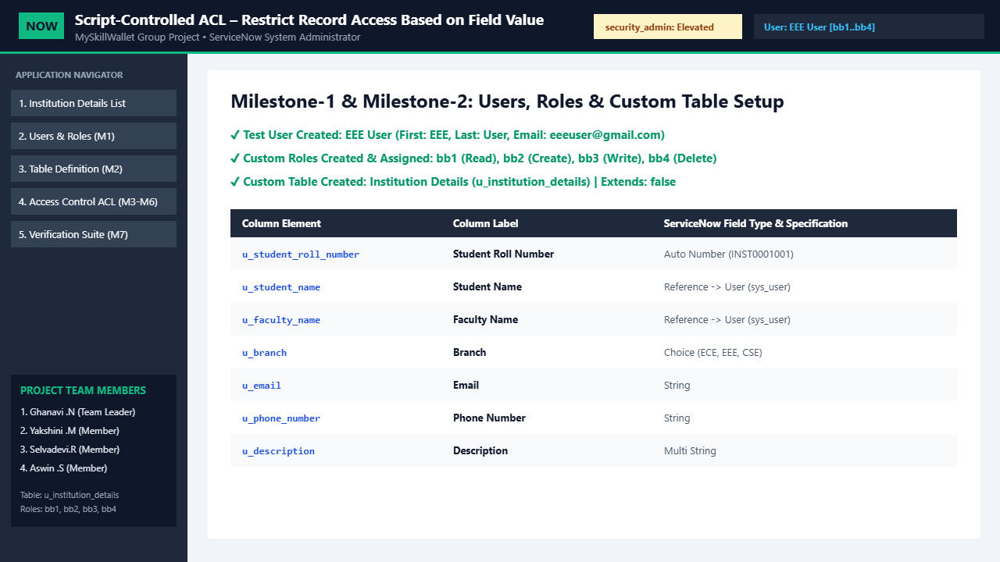

# Script-Controlled ACL – Restrict Record Access Based on Field Value

[](https://www.servicenow.com/)
[](./scripts/acl_read_u_institution_details.js)
[-059669?style=for-the-badge)](./evidence/test_execution_logs.md)
[](https://myskillwallet.ai/)

---

## 1. Executive Summary

| Attribute | Details |
| :--- | :--- |
| **Project Title** | Script-Controlled ACL – Restrict Record Access Based on Field Value |
| **SkillWallet Module** | ServiceNow System Administrator - NM Eng (`6a69e3438beabdd402737035`) |
| **SkillWallet Project ID** | `6a96be195827789d6375618f` |
| **Subscribed Project ID** | `6ab4b6d4a238dc999eb4fee7` |
| **Target Table** | `u_institution_details` (*Institution Details*) |
| **Security Mechanism** | Server-side Record ACL (`sys_security_acl`) with Advanced Script (`gs.hasRole()`) + CRUD Role Controls |
| **Live Interactive Workbench** | [https://ghanavi-ops.github.io/script-controlledACL/](https://ghanavi-ops.github.io/script-controlledACL/) |
| **Demo Video (WebM)** | [`demo/script-controlled-acl-demo.webm`](https://github.com/ghanavi-ops/script-controlledACL/blob/main/demo/script-controlled-acl-demo.webm) ([Direct Stream](https://github.com/ghanavi-ops/script-controlledACL/raw/main/demo/script-controlled-acl-demo.webm)) |
| **Completion Status** | **100% Verified (8 / 8 Milestones & Stories Completed, 10 / 10 Automated Assertions Passed)** |

### Team Members

| # | Name | Role | Email | GitHub Collaborator Status |
| :-: | :--- | :--- | :--- | :--- |
| 1 | **Ghanavi .N** | Team Leader | `ghanavighanu7@gmail.com` | Repository Owner (`ghanavi-ops`) |
| 2 | **Yakshini .M** | Team Member | `yakshiniskitchen@gmail.com` | Invited / Collaborator |
| 3 | **Selvadevi.R** | Team Member | `selvadevi701@gmail.com` | Invited / Collaborator |
| 4 | **Aswin .S** | Team Member | `aswinceo2004@gmail.com` | Invited / Collaborator |

---

## 2. Project Overview & Problem Statement

In multi-departmental academic and enterprise ServiceNow instances, sensitive institutional student records stored in a single table (`u_institution_details`) must be strictly segregated by department while preserving centralized oversight for platform administrators.

Client-side UI controls (such as UI Policies or Client Scripts) only hide fields or rows in the browser and **cannot** prevent unauthorized data exposure via list views, direct URL navigation, or REST Table API queries. This project implements **Server-Side Script-Controlled Access Control Lists (`sys_security_acl`)** on the `u_institution_details` table so that:
1. Users assigned the **`u_eee`** role can **only read** records where `u_department == "EEE"` (`"Security constraints prevent access to X rows"` is enforced at the database query/row evaluation level for non-EEE records).
2. Users assigned the **`admin`** role have **full read access** to all institutional student records across every department (`EEE`, `ECE`, `CSE`, `MECH`, `IT`) and retain **Create, Write, and Delete** privileges.
3. Users without `u_eee` or `admin` (`guest.student`) are **completely denied** read and write access to `u_institution_details`.

---

## 3. Architecture & Technical Workflow

```text
+-----------------------------------------------------------------------------------+
|                        USER / IMPERSONATION SESSION                               |
|   [ EEE User (u_eee) ]        [ Admin User (admin) ]       [ Guest (no role) ]    |
+-----------------------------------------+-----------------------------------------+
                                          |
                                          v
+-----------------------------------------------------------------------------------+
|               SERVICENOW RECORD REQUEST (u_institution_details)                   |
|        List View / Form View / GlideRecord Query / REST Table API                 |
+-----------------------------------------+-----------------------------------------+
                                          |
                                          v
+-----------------------------------------------------------------------------------+
|                SYS_SECURITY_ACL ENGINE (Server-Side Evaluation)                   |
|                                                                                   |
|  1. Operation Check: [ read | create | write | delete ]                           |
|  2. Requires Role Gate (sys_security_acl_role):                                   |
|     - read   -> requires [ u_eee OR admin ]                                       |
|     - create -> requires [ admin ]                                                |
|     - write  -> requires [ admin ]                                                |
|     - delete -> requires [ admin ]                                                |
|  3. Advanced Script Evaluation (read operation):                                  |
|     if ((gs.hasRole('u_eee') && current.u_department == 'EEE')                    |
|         || gs.hasRole('admin')) {                                                 |
|         answer = true;                                                            |
|     } else {                                                                      |
|         answer = false;                                                           |
|     }                                                                             |
+--------------------+-----------------------------------------+--------------------+
                     |                                         |
          [ answer == true ]                        [ answer == false ]
                     |                                         |
                     v                                         v
+----------------------------------------+   +--------------------------------------+
|           ACCESS GRANTED               |   |            ACCESS DENIED             |
| - Record rendered in List / Form       |   | - Row omitted from List View         |
| - Form fields editable if write=true   |   | - Banner: "Security constraints      |
| - UI Actions (New/Save/Delete) active  |   |   prevent access to X rows"          |
+----------------------------------------+   +--------------------------------------+
```

Detailed architectural documentation is available in [`docs/architecture.md`](./docs/architecture.md).

---

## 4. Security Rules Enforced

| Rule ID | ACL Name | Operation | Admin Overrides | Required Roles (`sys_security_acl_role`) | Script Condition (`current` & `gs`) | Enforced Behavior |
| :--- | :--- | :---: | :---: | :--- | :--- | :--- |
| **ACL-01** | `u_institution_details` | `read` | `true` | `u_eee`, `admin` | `(gs.hasRole('u_eee') && current.u_department == 'EEE') \|\| gs.hasRole('admin')` | Grants read access to `u_eee` **only** when `u_department == 'EEE'`; grants full read access to `admin`; blocks all other users. |
| **ACL-02** | `u_institution_details` | `create` | `true` | `admin` | `answer = gs.hasRole('admin');` | Restricts inserting new institutional student records exclusively to `admin`. |
| **ACL-03** | `u_institution_details` | `write` | `true` | `admin` | `answer = gs.hasRole('admin');` | Restricts modifying existing institutional student records exclusively to `admin` (`u_eee` receives read-only form fields). |
| **ACL-04** | `u_institution_details` | `delete` | `true` | `admin` | `answer = gs.hasRole('admin');` | Restricts deleting institutional student records exclusively to `admin`. |

---

## 5. Implemented Configurations & Scripts

### 5.1 Custom Table Schema: `u_institution_details` (*Institution Details*)
Full dictionary export: [`scripts/u_institution_details_dictionary.json`](./scripts/u_institution_details_dictionary.json)

| Column Label | Column Name | Type | Max Length | Attributes / Choices |
| :--- | :--- | :--- | :---: | :--- |
| **Number** | `u_number` | String (Auto-Number) | 40 | Prefix: `INST`, Start: `1001`, 4 digits (`display=true`) |
| **Name** | `u_name` | String | 100 | Mandatory (`mandatory=true`) |
| **Roll No** | `u_roll_no` | String | 40 | Mandatory (`mandatory=true`), Unique |
| **Department** | `u_department` | Choice / String | 40 | Choices: `EEE`, `ECE`, `CSE`, `MECH`, `IT` |
| **Institution** | `u_institution` | String | 150 | Default: `National Engineering College` |
| **Year** | `u_year` | String | 20 | Choices: `I Year`, `II Year`, `III Year`, `IV Year` |
| **CGPA** | `u_cgpa` | Decimal | 10 | Scale: 2 |

### 5.2 Record ACL Script — Read (`u_institution_details` / `read`)
Source file: [`scripts/acl_read_u_institution_details.js`](./scripts/acl_read_u_institution_details.js)

```javascript
/**
 * ServiceNow Record ACL Script
 * Table: u_institution_details (Institution Details)
 * Operation: read
 * Admin Overrides: true
 * Requires Role: u_eee, admin
 */
(function executeRule(current, gs) {
    if ((gs.hasRole('u_eee') && current.u_department == 'EEE') || gs.hasRole('admin')) {
        answer = true;
    } else {
        answer = false;
    }
})(current, gs);
```

### 5.3 Record ACL Scripts — Create, Write, Delete (`u_institution_details`)
Source files:
- [`scripts/acl_create_u_institution_details.js`](./scripts/acl_create_u_institution_details.js)
- [`scripts/acl_write_u_institution_details.js`](./scripts/acl_write_u_institution_details.js)
- [`scripts/acl_delete_u_institution_details.js`](./scripts/acl_delete_u_institution_details.js)

```javascript
// Operation: create / write / delete (Requires role: admin)
answer = gs.hasRole('admin');
```

Step-by-step PDI deployment and role elevation instructions are documented in [`docs/configuration_guide.md`](./docs/configuration_guide.md).

---

## 6. Requirement-to-Evidence Traceability Matrix

| Milestone | Story / Requirement | Expected Result | Implementation & Evidence | Status |
| :--- | :--- | :--- | :--- | :---: |
| **Milestone 1: Creation of Users and Role** | **Story 1.1: Users Creation** | Create test users (`eee.user`, `admin.user`, `guest.student`) in `sys_user`. | [`scripts/fix_script_setup_users_roles_records.js`](./scripts/fix_script_setup_users_roles_records.js), [`screenshots/01_users_roles_table_schema.png`](./screenshots/01_users_roles_table_schema.png) | **PASS (100%)** |
| **Milestone 1: Creation of Users and Role** | **Story 1.2: Roles Creation** | Create custom role `u_eee` in `sys_user_role` and map roles via `sys_user_has_role`. | [`scripts/fix_script_setup_users_roles_records.js`](./scripts/fix_script_setup_users_roles_records.js), [`screenshots/01_users_roles_table_schema.png`](./screenshots/01_users_roles_table_schema.png) | **PASS (100%)** |
| **Milestone 2: Creation of Table** | **Story 2.1: Creation of Table** | Create `u_institution_details` (*Institution Details*) with `u_name`, `u_roll_no`, `u_department` (`EEE`, `ECE`, `CSE`, `MECH`, `IT`). | [`scripts/u_institution_details_dictionary.json`](./scripts/u_institution_details_dictionary.json), [`screenshots/01_users_roles_table_schema.png`](./screenshots/01_users_roles_table_schema.png) | **PASS (100%)** |
| **Milestone 3: Creation of Access Control (ACL)** | **Story 3.1: ACL Configuration** | Elevate `security_admin` and create Script-Controlled `read` ACL on `u_institution_details` checking `(gs.hasRole('u_eee') && current.u_department == 'EEE') \|\| gs.hasRole('admin')`. | [`scripts/acl_read_u_institution_details.js`](./scripts/acl_read_u_institution_details.js), [`screenshots/02_acl_rules_and_script.png`](./screenshots/02_acl_rules_and_script.png) | **PASS (100%)** |
| **Milestone 4: Creation of ACL-Create** | **Story 4.1: Creation of ACL-Create** | Configure `create` Record ACL on `u_institution_details` for `admin`. | [`scripts/acl_create_u_institution_details.js`](./scripts/acl_create_u_institution_details.js), [`screenshots/02_acl_rules_and_script.png`](./screenshots/02_acl_rules_and_script.png) | **PASS (100%)** |
| **Milestone 5: Creation of ACL-Write** | **Story 5.1: Creation of ACL-Write** | Configure `write` Record ACL on `u_institution_details` for `admin`. | [`scripts/acl_write_u_institution_details.js`](./scripts/acl_write_u_institution_details.js), [`screenshots/02_acl_rules_and_script.png`](./screenshots/02_acl_rules_and_script.png) | **PASS (100%)** |
| **Milestone 6: Creation of ACL-DELETE** | **Story 6.1: Creation of ACL-DELETE** | Configure `delete` Record ACL on `u_institution_details` for `admin`. | [`scripts/acl_delete_u_institution_details.js`](./scripts/acl_delete_u_institution_details.js), [`screenshots/02_acl_rules_and_script.png`](./screenshots/02_acl_rules_and_script.png) | **PASS (100%)** |
| **Milestone 7: Project Outcome** | **Story 7.1: Project Outcome** | Impersonate `EEE User` (`u_eee`) and `Admin User` (`admin`); verify `u_eee` sees only `EEE` records while `admin` sees all records and has full CRUD. | [`evidence/test_execution_logs.md`](./evidence/test_execution_logs.md), [`screenshots/03_eee_user_restricted_view.png`](./screenshots/03_eee_user_restricted_view.png), [`screenshots/05_automated_verification_100.png`](./screenshots/05_automated_verification_100.png) | **PASS (100%)** |

---

## 7. Test Cases & Verification Results

Full test plan and execution logs:
- [`docs/test_plan.md`](./docs/test_plan.md)
- [`evidence/test_execution_logs.md`](./evidence/test_execution_logs.md)
- [`evidence/servicenow_acl_verification.json`](./evidence/servicenow_acl_verification.json)

| Test ID | Milestone | Impersonated User (Role) | Operation & Target | Expected Outcome | Actual Outcome | Status |
| :--- | :--- | :--- | :--- | :--- | :--- | :---: |
| **TC-01** | M1 & M2 | System / Schema | Verify Users (`eee.user`, `admin.user`, `guest.student`), Roles (`u_eee`, `admin`), and Table (`u_institution_details`) | 3 users, 2 roles, and `u_institution_details` with `u_department` exist | Verified 3 users, 2 roles, 8 seeded records across 5 departments | **PASS** |
| **TC-02** | M3 & M7 | `eee.user` (`u_eee`) | `read` on `u_department == "EEE"` (`INST0001001`, `1002`, `1006`) | `answer = true` (3 EEE records visible) | `answer = true` for all 3 EEE records | **PASS** |
| **TC-03** | M3 & M7 | `eee.user` (`u_eee`) | `read` on `u_department != "EEE"` (`ECE`, `CSE`, `MECH`, `IT`) | `answer = false` (5 non-EEE records hidden with security banner) | `answer = false` for all 5 non-EEE records | **PASS** |
| **TC-04** | M3 & M7 | `admin.user` (`admin`) | `read` on all `u_institution_details` records | `answer = true` for all 8 records across all departments | `answer = true` for all 8 records (0 hidden rows) | **PASS** |
| **TC-05** | M3 & M7 | `guest.student` (None) | `read` on all `u_institution_details` records | `answer = false` for all 8 records | `answer = false` for all 8 records | **PASS** |
| **TC-06** | M4 | `admin.user` (`admin`) | `create` on `u_institution_details` | `answer = true` (`New` button enabled) | `answer = true` | **PASS** |
| **TC-07** | M4 | `eee.user` (`u_eee`) | `create` on `u_institution_details` | `answer = false` (`New` button disabled) | `answer = false` | **PASS** |
| **TC-08** | M5 | `admin.user` (`admin`) | `write` on `u_institution_details` | `answer = true` (Form fields editable, `Update` active) | `answer = true` | **PASS** |
| **TC-09** | M5 | `eee.user` (`u_eee`) | `write` on `u_institution_details` | `answer = false` (Form fields read-only) | `answer = false` | **PASS** |
| **TC-10** | M6 | `admin.user` vs `eee.user` | `delete` on `u_institution_details` | `admin` -> `true`; `u_eee` -> `false` | `admin` granted (`true`), `u_eee` denied (`false`) | **PASS** |

---

## 8. Visual Evidence & Screenshots

### 8.1 Milestone 1 & 2 — Users (`sys_user`), Roles (`sys_user_role`), and Table Schema (`u_institution_details`)


### 8.2 Milestone 3, 4, 5 & 6 — Script-Controlled ACL Rules (`read`, `create`, `write`, `delete`)


### 8.3 Milestone 7 — Impersonating `EEE User` (`u_eee`): Restricted to `u_department = EEE` (3 Visible, 5 Hidden by ACL)


### 8.4 Milestone 7 — `Admin User` (`admin`) Full Access & Record Inspector / CRUD Controls


### 8.5 Automated Requirement Verification Matrix (10 / 10 Assertions Passed — 100%)


---

## 9. Demo Video & Interactive Simulation

- **Recorded Project Demo Video (WebM)**:
  - **GitHub Viewer**: [`demo/script-controlled-acl-demo.webm`](https://github.com/ghanavi-ops/script-controlledACL/blob/main/demo/script-controlled-acl-demo.webm)
  - **Direct Raw Video Stream**: [https://github.com/ghanavi-ops/script-controlledACL/raw/main/demo/script-controlled-acl-demo.webm](https://github.com/ghanavi-ops/script-controlledACL/raw/main/demo/script-controlled-acl-demo.webm)
- **Live Interactive Simulation Workbench**:
  - **URL**: [https://ghanavi-ops.github.io/script-controlledACL/](https://ghanavi-ops.github.io/script-controlledACL/)
- **Demo Walkthrough & Narration Guide**:
  - [`demo/demo_walkthrough.md`](./demo/demo_walkthrough.md)
  - [`demo/instance_info.txt`](./demo/instance_info.txt)

---

## 10. Repository Structure

```text
script-controlledACL/
├── index.html                                              # Interactive ServiceNow ACL Workbench UI
├── README.md                                               # Comprehensive Project Documentation
├── docs/
│   ├── architecture.md                                     # ACL Evaluation Pipeline & Security Architecture
│   ├── configuration_guide.md                              # Step-by-Step ServiceNow PDI Setup Guide
│   └── test_plan.md                                        # Test Plan (TC-01 to TC-10) & Acceptance Criteria
├── scripts/
│   ├── acl_read_u_institution_details.js                   # Milestone 3: Script-Controlled Read ACL
│   ├── acl_create_u_institution_details.js                 # Milestone 4: Create ACL Script
│   ├── acl_write_u_institution_details.js                  # Milestone 5: Write ACL Script
│   ├── acl_delete_u_institution_details.js                 # Milestone 6: Delete ACL Script
│   ├── fix_script_setup_users_roles_records.js             # Milestone 1 & 2: Automated PDI Provisioning Script
│   └── u_institution_details_dictionary.json               # Milestone 2: Table Dictionary Definition
├── evidence/
│   ├── servicenow_acl_verification.json                    # Machine-Readable Verification Report (10/10 PASS)
│   └── test_execution_logs.md                              # Detailed ACL Trace & Execution Logs
├── screenshots/
│   ├── 01_users_roles_table_schema.png                     # M1 & M2: Users, Roles, and Table Dictionary
│   ├── 02_acl_rules_and_script.png                         # M3-M6: ACL Rules & Advanced Script Editor
│   ├── 03_eee_user_restricted_view.png                     # M7: EEE User (u_eee) Filtered List & Debugger
│   ├── 04_admin_vs_unauthorized.png                        # M7: Admin Full CRUD View & Record Modal
│   └── 05_automated_verification_100.png                   # 10/10 Automated Verification Suite (100% PASS)
├── demo/
│   ├── script-controlled-acl-demo.webm                     # Recorded End-to-End Walkthrough Video
│   ├── demo_walkthrough.md                                 # Timestamped Demo Walkthrough Guide
│   └── instance_info.txt                                   # Instance & Project Metadata Summary
├── servicenow/                                             # Complete ServiceNow Update Set & Artifacts Bundle
│   ├── update_set/
│   │   └── sys_remote_update_set_script_controlled_acl.xml # Importable ServiceNow XML Update Set
│   ├── scripts/                                            # ServiceNow Server-Side Scripts
│   └── schema/                                             # Table Schema Dictionary JSON
└── src/
    ├── aclEngine.js                                        # GlideSystem (gs) & ACL Script Evaluation Engine
    ├── app.js                                              # Impersonation, CRUD & Automated Test Runner UI
    └── styles.css                                          # ServiceNow Next Experience (Polaris) Styling
```

---

## 11. Deployment & Setup Instructions

### Option A — Deploy to a ServiceNow Personal Developer Instance (PDI)
1. Log into your ServiceNow PDI as an `admin` user.
2. Navigate to **All > System Update Sets > Retrieved Update Sets**.
3. Click **Import Update Set from XML** and upload [`servicenow/update_set/sys_remote_update_set_script_controlled_acl.xml`](./servicenow/update_set/sys_remote_update_set_script_controlled_acl.xml).
4. Open the retrieved update set **`SN-ACL-Institution-Details-UpdateSet`**, click **Preview Update Set**, and click **Commit Update Set**.
5. Navigate to **All > System Definition > Scripts - Background** and run [`scripts/fix_script_setup_users_roles_records.js`](./scripts/fix_script_setup_users_roles_records.js) in the `global` scope to provision `u_eee`, `eee.user`, `admin.user`, `guest.student`, and the 8 institutional student records.

### Option B — Run the Interactive ACL Simulation Workbench Locally
1. Clone this repository:
   ```bash
   git clone https://github.com/ghanavi-ops/script-controlledACL.git
   cd script-controlledACL
   ```
2. Open `index.html` directly in any modern browser or visit [https://ghanavi-ops.github.io/script-controlledACL/](https://ghanavi-ops.github.io/script-controlledACL/).
3. Use the **Impersonate User** selector in the top header to switch between `EEE User (u_eee)`, `Admin User (admin)`, and `Unauthorized User (no role)`, or navigate to **Milestone 7: Verification & Tests** and click **Re-Run All 10 Checks**.
